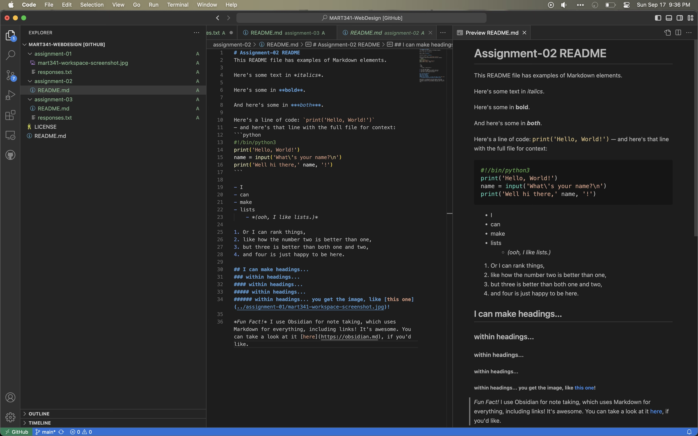
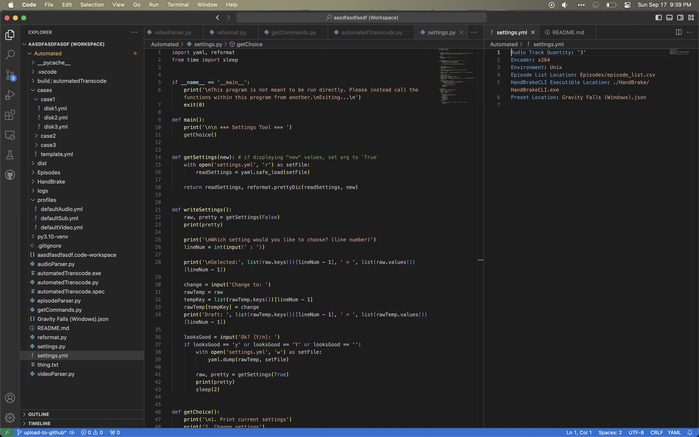

# Assignment-03 README

Here's a screenshot of the [assignment-02 README](../assignment-02/README.md) being actively written:

([link to image](mart341-workspace-a3.jpg))

I actually have been using VS Code for a number of years now, and have gotten quite familiar with it. I have it set up fairly close to how I like it. Here's a screenshot of it in action:

Once I upload it to Github, I'll edit this file with the link to it.