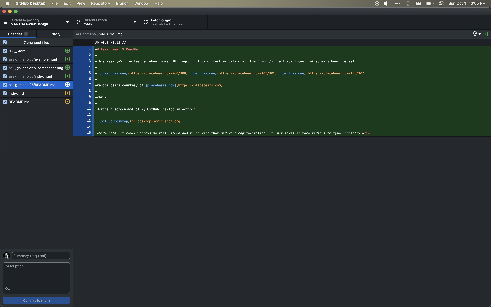

# Assignment 5 ReadMe

This week (#5), we learned about more HTML tags, including (most exicitingly), the `` tag! Now I can link so many bear images!

  

random bears courtesy of [placebears.com](https://placebears.com)

 

Here's a screenshot of my GitHub Desktop in action:

*Side note, it really annoys me that GitHub had to go with that mid-word capitalization. It just makes it more tedious to type correctly.*